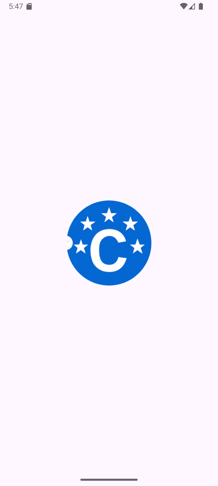
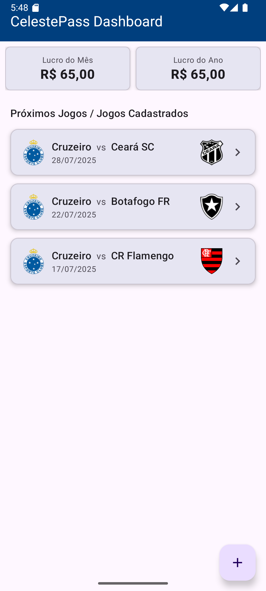
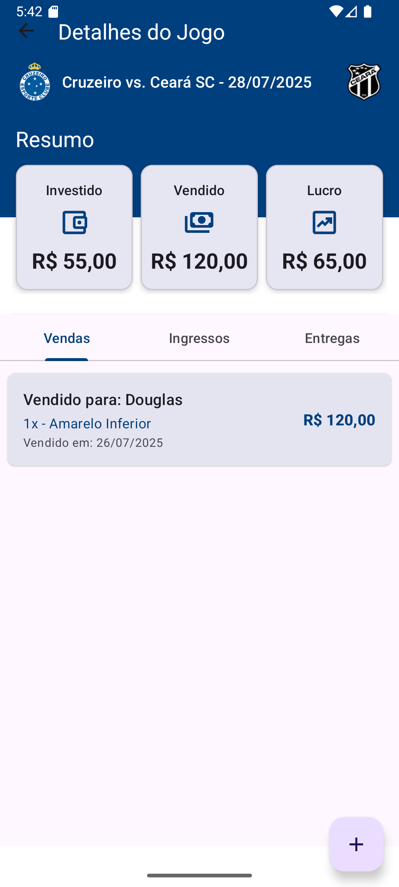

# 🎟️ CelestePass

**CelestePass** é um aplicativo Android para gerenciamento de vendas de ingressos para jogos do Cruzeiro Esporte Clube. Com uma interface moderna e foco em usabilidade, o app permite organizar setores, controlar vendas, cadastrar clientes e acompanhar lucros de forma prática e inteligente.

---

## 📱 Funcionalidades

- 🔹 Cadastro de setores de ingressos (ex: Amarelo Superior, Inferior, etc.)
- 🔹 Registro de compras e vendas com controle de quantidade e valores
- 🔹 Cálculo automático de lucro com base no custo e valor de venda
- 🔹 Cadastro de clientes para controle de entregas
- 🔹 Marcar vendas como **entregues**
- 🔹 Notificação configurável para lembrar da entrega nos dias de jogo
- 🔹 Swipe-to-delete com confirmação e lógica de devolução ao lote
- 🔹 Interface intuitiva com foco em produtividade

---

## 🖼️ Telas do aplicativo

  

---

## 🛠️ Tecnologias

| Camada         | Tecnologias                                                   |
|----------------|---------------------------------------------------------------|
| 📱 Mobile      | Kotlin, Android Jetpack, ViewModel, LiveData, ViewBinding     |
| ☁️ Backend (futuro) | Java + Spring Boot (opcional, para dados na nuvem)          |
| 💾 Local       | Room Database (ou Realm, dependendo da versão final)          |
| 🔔 Notificações| WorkManager (em breve)                                        |
| 🎨 UI          | Material Design 3, XML Layouts                                |

---

## 🚀 Instalação

1. Clone o repositório:
   ```bash
   git clone https://github.com/luan-fb/CelestePass.git
   ```
2. Abra no Android Studio (Kotlin DSL)
3. Compile e execute em um dispositivo físico ou emulador Android (API 26+)

---

## 📦 Estrutura de Pastas (resumo)

```
CelestePass/
├── app/
│   ├── src/main/
│   │   ├── java/com/luanferreira/celestepass/
│   │   │   ├── ui/          # Fragments, Adapters
│   │   │   ├── model/       # Entidades (Venda, Cliente, Setor)
│   │   │   ├── viewmodel/   # DetalhesJogoViewModel e outros
│   │   │   └── repository/  # Lógica de dados
│   │   └── res/             # Layouts, drawables, valores
```

---

## ✨ Futuras melhorias

- 🔄 Sincronização em nuvem
- 📆 Agenda com calendário de jogos
- 🔔 Notificações personalizadas por cliente
- 📊 Gráficos de lucro/venda
- 🌐 API externa com dados dos jogos

---

## 👨‍💻 Autor

Desenvolvido por **[Luan Ferreira](https://github.com/luan-fb)**  
Estudante de Sistemas de Informação | Dev Android Kotlin & Java

---

## 📄 Licença

Este projeto está sob a licença MIT. Veja o arquivo [LICENSE](LICENSE) para mais detalhes.
